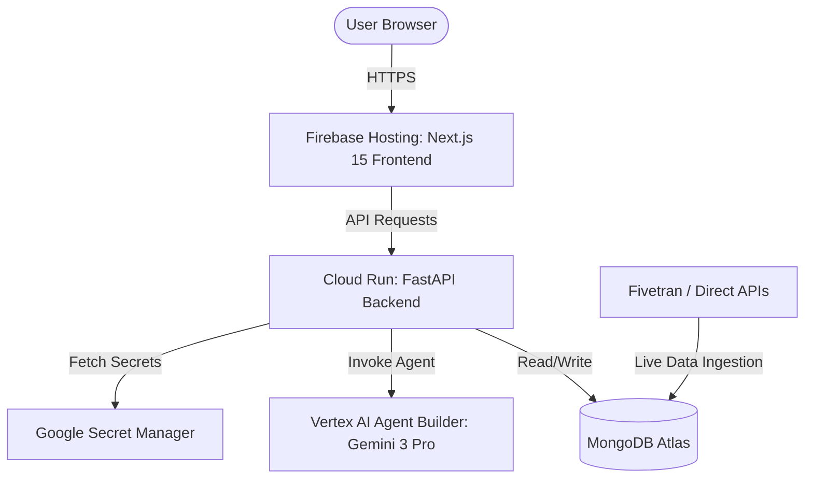

# Offside AI - System Architecture

This document describes the design and deployment architecture for **Offside AI**.

## System Overview

## Technology Stack

### 1. Frontend
- **Framework:** Next.js 15 (App Router, TypeScript)
- **Styling & UI:** Tailwind CSS, ShadCN UI
- **Animations:** Framer Motion
- **Hosting:** Firebase Hosting

### 2. Backend
- **Framework:** FastAPI (Python 3.12)
- **Server:** Uvicorn
- **Containerization:** Docker
- **Deployment:** Google Cloud Run

### 3. AI & Agents
- **Orchestration:** Vertex AI Agent Builder
- **Model:** Gemini 3 Pro
- **Integration:** GCP Python SDK / Google GenAI SDK

### 4. Database & Secrets
- **Database:** MongoDB Atlas (Async Motor driver)
- **MCP integration:** MongoDB MCP Server
- **Secrets Management:** Google Secret Manager (GSM)

### 5. Ingestion Pipeline
- **Method:** Fivetran / Custom cron jobs for direct live API data ingestion
